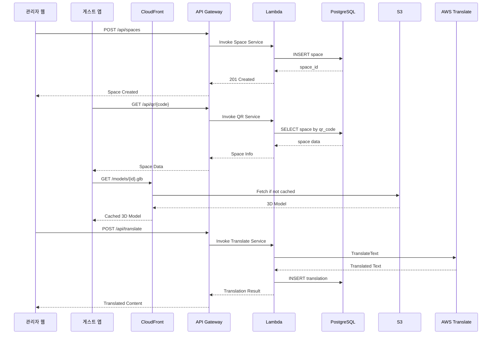

# LocalRule 시스템 아키텍처 설계서

**프로젝트명**: LocalRule - 센서 기반 VR 공간 규칙 탐색 플랫폼  
**버전**: 1.0  
**작성일**: 2024-12-10  
**아키텍처 패턴**: Serverless + Microservices Hybrid

---

## 목차
1. [시스템 개요](#1-시스템-개요)
2. [전체 아키텍처](#2-전체-아키텍처)
3. [클라이언트 아키텍처](#3-클라이언트-아키텍처)
4. [백엔드 아키텍처](#4-백엔드-아키텍처)
5. [AWS 인프라](#5-aws-인프라)
6. [데이터 흐름](#6-데이터-흐름)
7. [보안 아키텍처](#7-보안-아키텍처)
8. [성능 최적화](#8-성능-최적화)
9. [모니터링 및 로깅](#9-모니터링-및-로깅)
10. [배포 전략](#10-배포-전략)

---

## 1. 시스템 개요

### 1.1 시스템 구성 요소

| 구성 요소 | 설명 | 기술 스택 |
|-----------|------|-----------|
| 관리자 웹 대시보드 | 공간/객체/규칙 관리 | React, TypeScript, Three.js |
| 게스트 모바일 앱 | VR/AR 공간 탐색 | React Native, Expo, Three.js |
| Backend API | RESTful API 서버 | Node.js, Express, TypeScript |
| Database | 관계형 데이터베이스 | PostgreSQL (RDS) |
| File Storage | 정적 파일 저장소 | AWS S3 + CloudFront |
| Authentication | 사용자 인증 | AWS Cognito + JWT |
| Translation | 다국어 번역 | AWS Translate |
| ML Service | 객체 인식 | ML Kit (모바일) |

### 1.2 설계 원칙

- **Serverless First**: Lambda 기반으로 운영 비용 최소화
- **Scalability**: 오토스케일링으로 트래픽 대응
- **Security**: 다층 보안 (HTTPS, JWT, IAM)
- **Performance**: CDN, 캐싱으로 응답 속도 최적화
- **Maintainability**: 모듈화, 문서화, 테스트 자동화


---

## 2. 전체 아키텍처

### 2.1 High-Level Architecture Diagram

```
┌─────────────────────────────────────────────────────────────────────────────────┐
│                              LocalRule Platform                                  │
├─────────────────────────────────────────────────────────────────────────────────┤
│                                                                                  │
│  ┌─────────────────────┐              ┌─────────────────────┐                   │
│  │   관리자 웹 앱       │              │   게스트 모바일 앱   │                   │
│  │   (React SPA)       │              │   (React Native)    │                   │
│  │                     │              │                     │                   │
│  │  • 공간 관리        │              │  • QR 스캔          │                   │
│  │  • 2D 배치 도구     │              │  • VR 모드          │                   │
│  │  • LocalRule 입력   │              │  • AR 모드          │                   │
│  │  • 3D 미리보기      │              │  • 센서 기반 이동    │                   │
│  └──────────┬──────────┘              └──────────┬──────────┘                   │
│             │                                    │                              │
│             │ HTTPS                              │ HTTPS                        │
│             ▼                                    ▼                              │
│  ┌──────────────────────────────────────────────────────────────┐              │
│  │                    AWS CloudFront (CDN)                       │              │
│  │              • 정적 자산 캐싱 (3D 모델, 이미지)                │              │
│  │              • HTTPS 종단점                                   │              │
│  │              • 글로벌 엣지 로케이션                           │              │
│  └──────────────────────────┬───────────────────────────────────┘              │
│                             │                                                   │
│                             ▼                                                   │
│  ┌──────────────────────────────────────────────────────────────┐              │
│  │                    AWS API Gateway                            │              │
│  │              • REST API 라우팅                                │              │
│  │              • Rate Limiting (100 req/min)                   │              │
│  │              • Request Validation                            │              │
│  │              • CORS 설정                                     │              │
│  └──────────────────────────┬───────────────────────────────────┘              │
│                             │                                                   │
│                             ▼                                                   │
│  ┌──────────────────────────────────────────────────────────────┐              │
│  │                    AWS Lambda Functions                       │              │
│  │  ┌─────────┐ ┌─────────┐ ┌─────────┐ ┌─────────┐ ┌─────────┐│              │
│  │  │  Auth   │ │  Space  │ │ Object  │ │  Rule   │ │Translate││              │
│  │  │ Service │ │ Service │ │ Service │ │ Service │ │ Service ││              │
│  │  └────┬────┘ └────┬────┘ └────┬────┘ └────┬────┘ └────┬────┘│              │
│  └───────┼──────────┼──────────┼──────────┼──────────┼────────┘              │
│          │          │          │          │          │                         │
│          ▼          ▼          ▼          ▼          ▼                         │
│  ┌──────────────────────────────────────────────────────────────┐              │
│  │                         VPC                                   │              │
│  │  ┌────────────────────┐    ┌────────────────────┐           │              │
│  │  │   RDS PostgreSQL   │    │      AWS S3        │           │              │
│  │  │   (Primary + Read) │    │  (3D/이미지/메쉬)   │           │              │
│  │  └────────────────────┘    └────────────────────┘           │              │
│  └──────────────────────────────────────────────────────────────┘              │
│                                                                                  │
│  ┌──────────────────────────────────────────────────────────────┐              │
│  │                    External Services                          │              │
│  │  ┌─────────────┐  ┌─────────────┐  ┌─────────────┐          │              │
│  │  │AWS Cognito  │  │AWS Translate│  │ CloudWatch  │          │              │
│  │  │(인증/인가)   │  │(다국어 번역) │  │(모니터링)    │          │              │
│  │  └─────────────┘  └─────────────┘  └─────────────┘          │              │
│  └──────────────────────────────────────────────────────────────┘              │
│                                                                                  │
└─────────────────────────────────────────────────────────────────────────────────┘
```

### 2.2 컴포넌트 상호작용




---

## 3. 클라이언트 아키텍처

### 3.1 관리자 웹 대시보드

```
┌─────────────────────────────────────────────────────────────────┐
│                    Admin Web Dashboard                           │
│                    (React + TypeScript)                          │
├─────────────────────────────────────────────────────────────────┤
│                                                                  │
│  ┌─────────────────────────────────────────────────────────┐   │
│  │                    Presentation Layer                    │   │
│  │  ┌─────────┐ ┌─────────┐ ┌─────────┐ ┌─────────┐       │   │
│  │  │  Pages  │ │Components│ │  Hooks  │ │ Layouts │       │   │
│  │  └─────────┘ └─────────┘ └─────────┘ └─────────┘       │   │
│  └─────────────────────────────────────────────────────────┘   │
│                              │                                   │
│  ┌─────────────────────────────────────────────────────────┐   │
│  │                    State Management                      │   │
│  │  ┌─────────────────┐  ┌─────────────────┐              │   │
│  │  │   Zustand       │  │   React Query   │              │   │
│  │  │ (Client State)  │  │ (Server State)  │              │   │
│  │  └─────────────────┘  └─────────────────┘              │   │
│  └─────────────────────────────────────────────────────────┘   │
│                              │                                   │
│  ┌─────────────────────────────────────────────────────────┐   │
│  │                    Feature Modules                       │   │
│  │  ┌─────────┐ ┌─────────┐ ┌─────────┐ ┌─────────┐       │   │
│  │  │  Auth   │ │  Space  │ │ Object  │ │  Rule   │       │   │
│  │  │ Module  │ │ Module  │ │ Module  │ │ Module  │       │   │
│  │  └─────────┘ └─────────┘ └─────────┘ └─────────┘       │   │
│  │  ┌─────────┐ ┌─────────┐ ┌─────────┐                   │   │
│  │  │ Trigger │ │   QR    │ │ Preview │                   │   │
│  │  │ Module  │ │ Module  │ │ Module  │                   │   │
│  │  └─────────┘ └─────────┘ └─────────┘                   │   │
│  └─────────────────────────────────────────────────────────┘   │
│                              │                                   │
│  ┌─────────────────────────────────────────────────────────┐   │
│  │                    Core Libraries                        │   │
│  │  ┌─────────┐ ┌─────────┐ ┌─────────┐ ┌─────────┐       │   │
│  │  │Three.js │ │Fabric.js│ │  Axios  │ │React    │       │   │
│  │  │(3D View)│ │(2D Edit)│ │ (HTTP)  │ │Router   │       │   │
│  │  └─────────┘ └─────────┘ └─────────┘ └─────────┘       │   │
│  └─────────────────────────────────────────────────────────┘   │
│                                                                  │
└─────────────────────────────────────────────────────────────────┘
```

#### 3.1.1 디렉토리 구조

```
admin-dashboard/
├── public/
│   └── assets/
├── src/
│   ├── components/          # 공통 UI 컴포넌트
│   │   ├── common/
│   │   ├── layout/
│   │   └── ui/
│   ├── features/            # 기능별 모듈
│   │   ├── auth/
│   │   ├── space/
│   │   ├── object/
│   │   ├── rule/
│   │   ├── trigger/
│   │   └── preview/
│   ├── hooks/               # 커스텀 훅
│   ├── lib/                 # 유틸리티
│   │   ├── api/
│   │   ├── three/
│   │   └── fabric/
│   ├── stores/              # Zustand 스토어
│   ├── types/               # TypeScript 타입
│   └── App.tsx
├── package.json
└── vite.config.ts
```

#### 3.1.2 주요 기술 스택

| 카테고리 | 기술 | 버전 | 용도 |
|----------|------|------|------|
| Framework | React | 18.2 | UI 프레임워크 |
| Language | TypeScript | 5.0 | 타입 안정성 |
| Build Tool | Vite | 5.0 | 빌드/번들링 |
| 3D Rendering | Three.js | r158 | 3D 미리보기 |
| 3D React | React Three Fiber | 8.15 | Three.js React 통합 |
| 2D Editor | Fabric.js | 5.3 | 2D 배치 도구 |
| State | Zustand | 4.4 | 클라이언트 상태 |
| Server State | TanStack Query | 5.0 | API 캐싱 |
| HTTP | Axios | 1.6 | API 통신 |
| Routing | React Router | 6.20 | 라우팅 |
| UI | Tailwind CSS | 3.4 | 스타일링 |
| UI Components | shadcn/ui | - | UI 컴포넌트 |

### 3.2 게스트 모바일 앱

```
┌─────────────────────────────────────────────────────────────────┐
│                    Guest Mobile App                              │
│                    (React Native + Expo)                         │
├─────────────────────────────────────────────────────────────────┤
│                                                                  │
│  ┌─────────────────────────────────────────────────────────┐   │
│  │                    UI Layer                              │   │
│  │  ┌─────────┐ ┌─────────┐ ┌─────────┐ ┌─────────┐       │   │
│  │  │ Screens │ │Components│ │Navigation│ │ Themes │       │   │
│  │  └─────────┘ └─────────┘ └─────────┘ └─────────┘       │   │
│  └─────────────────────────────────────────────────────────┘   │
│                              │                                   │
│  ┌─────────────────────────────────────────────────────────┐   │
│  │                    VR/AR Engine                          │   │
│  │  ┌─────────────────┐  ┌─────────────────┐              │   │
│  │  │   Three.js      │  │   AR Module     │              │   │
│  │  │  (3D Renderer)  │  │ (ARKit/ARCore)  │              │   │
│  │  └─────────────────┘  └─────────────────┘              │   │
│  │  ┌─────────────────┐  ┌─────────────────┐              │   │
│  │  │  Raycaster      │  │   LOD Manager   │              │   │
│  │  │ (Interaction)   │  │  (Performance)  │              │   │
│  │  └─────────────────┘  └─────────────────┘              │   │
│  └─────────────────────────────────────────────────────────┘   │
│                              │                                   │
│  ┌─────────────────────────────────────────────────────────┐   │
│  │                    Sensor Module                         │   │
│  │  ┌─────────┐ ┌─────────┐ ┌─────────┐ ┌─────────┐       │   │
│  │  │Pedometer│ │Gyroscope│ │Magneto- │ │Accelero-│       │   │
│  │  │         │ │         │ │ meter   │ │ meter   │       │   │
│  │  └─────────┘ └─────────┘ └─────────┘ └─────────┘       │   │
│  │  ┌─────────────────────────────────────────────┐       │   │
│  │  │           Kalman Filter (Noise Reduction)    │       │   │
│  │  └─────────────────────────────────────────────┘       │   │
│  └─────────────────────────────────────────────────────────┘   │
│                              │                                   │
│  ┌─────────────────────────────────────────────────────────┐   │
│  │                    Core Services                         │   │
│  │  ┌─────────┐ ┌─────────┐ ┌─────────┐ ┌─────────┐       │   │
│  │  │   API   │ │ Storage │ │   i18n  │ │  QR     │       │   │
│  │  │ Client  │ │ (Async) │ │(다국어) │ │ Scanner │       │   │
│  │  └─────────┘ └─────────┘ └─────────┘ └─────────┘       │   │
│  └─────────────────────────────────────────────────────────┘   │
│                                                                  │
└─────────────────────────────────────────────────────────────────┘
```

#### 3.2.1 디렉토리 구조

```
guest-app/
├── app/                     # Expo Router 페이지
│   ├── (tabs)/
│   ├── space/
│   └── settings/
├── src/
│   ├── components/          # UI 컴포넌트
│   ├── features/
│   │   ├── qr/             # QR 스캔
│   │   ├── vr/             # VR 모드
│   │   ├── ar/             # AR 모드
│   │   └── sensor/         # 센서 처리
│   ├── engine/             # 3D 엔진
│   │   ├── renderer/
│   │   ├── camera/
│   │   ├── raycaster/
│   │   └── loader/
│   ├── sensor/             # 센서 모듈
│   │   ├── pedometer/
│   │   ├── gyroscope/
│   │   ├── kalman/
│   │   └── calibration/
│   ├── services/           # API/Storage
│   ├── i18n/               # 다국어
│   └── utils/
├── assets/
├── app.json
└── package.json
```

#### 3.2.2 주요 기술 스택

| 카테고리 | 기술 | 버전 | 용도 |
|----------|------|------|------|
| Framework | React Native | 0.73 | 크로스 플랫폼 |
| Platform | Expo | 50 | 개발 환경 |
| Language | TypeScript | 5.0 | 타입 안정성 |
| 3D Rendering | Three.js | r158 | 3D VR 렌더링 |
| 3D React | React Three Fiber | 8.15 | Three.js 통합 |
| Sensors | expo-sensors | 13.0 | 센서 접근 |
| AR | expo-ar | - | AR 기능 |
| Camera | expo-camera | 14.0 | QR 스캔 |
| Storage | AsyncStorage | 1.21 | 로컬 저장소 |
| Navigation | Expo Router | 3.0 | 라우팅 |
| i18n | i18next | 23.7 | 다국어 |

#### 3.2.3 센서 데이터 처리 파이프라인

```
┌─────────────────────────────────────────────────────────────────┐
│                    Sensor Data Pipeline                          │
├─────────────────────────────────────────────────────────────────┤
│                                                                  │
│  Raw Sensors (30Hz)                                             │
│  ┌─────────┐ ┌─────────┐ ┌─────────┐ ┌─────────┐              │
│  │Pedometer│ │Gyroscope│ │Magneto  │ │Accelero │              │
│  │ steps   │ │ x,y,z   │ │ heading │ │ x,y,z   │              │
│  └────┬────┘ └────┬────┘ └────┬────┘ └────┬────┘              │
│       │          │          │          │                        │
│       ▼          ▼          ▼          ▼                        │
│  ┌─────────────────────────────────────────────────────────┐   │
│  │              Low-Pass Filter (고주파 노이즈 제거)         │   │
│  └─────────────────────────────────────────────────────────┘   │
│                              │                                   │
│                              ▼                                   │
│  ┌─────────────────────────────────────────────────────────┐   │
│  │              Kalman Filter (센서 융합)                    │   │
│  │  • 예측 단계: 이전 상태 + 모션 모델                       │   │
│  │  • 업데이트 단계: 센서 측정값으로 보정                    │   │
│  └─────────────────────────────────────────────────────────┘   │
│                              │                                   │
│                              ▼                                   │
│  ┌─────────────────────────────────────────────────────────┐   │
│  │              Movement Threshold (5cm 미만 무시)          │   │
│  └─────────────────────────────────────────────────────────┘   │
│                              │                                   │
│                              ▼                                   │
│  ┌─────────────────────────────────────────────────────────┐   │
│  │              Position & Rotation Update                  │   │
│  │  • position: { x, y, z }                                │   │
│  │  • rotation: { pitch, yaw, roll }                       │   │
│  └─────────────────────────────────────────────────────────┘   │
│                              │                                   │
│                              ▼                                   │
│  ┌─────────────────────────────────────────────────────────┐   │
│  │              3D Camera Update (60fps)                    │   │
│  └─────────────────────────────────────────────────────────┘   │
│                                                                  │
└─────────────────────────────────────────────────────────────────┘
```


---

## 4. 백엔드 아키텍처

### 4.1 서비스 구조

```
┌─────────────────────────────────────────────────────────────────┐
│                    Backend Services                              │
│                    (Node.js + TypeScript)                        │
├─────────────────────────────────────────────────────────────────┤
│                                                                  │
│  ┌─────────────────────────────────────────────────────────┐   │
│  │                    API Gateway Layer                     │   │
│  │  • Route: /api/v1/*                                     │   │
│  │  • Rate Limiting: 100 req/min/user                      │   │
│  │  • Request Validation                                   │   │
│  │  • CORS: admin.localrule.app, *.localrule.app          │   │
│  └─────────────────────────────────────────────────────────┘   │
│                              │                                   │
│  ┌─────────────────────────────────────────────────────────┐   │
│  │                    Lambda Functions                      │   │
│  │                                                          │   │
│  │  ┌───────────────┐  ┌───────────────┐                  │   │
│  │  │ Auth Service  │  │ Space Service │                  │   │
│  │  │               │  │               │                  │   │
│  │  │ • register    │  │ • create      │                  │   │
│  │  │ • login       │  │ • list        │                  │   │
│  │  │ • logout      │  │ • get         │                  │   │
│  │  │ • refresh     │  │ • update      │                  │   │
│  │  │ • resetPwd    │  │ • delete      │                  │   │
│  │  └───────────────┘  │ • publish     │                  │   │
│  │                     └───────────────┘                  │   │
│  │  ┌───────────────┐  ┌───────────────┐                  │   │
│  │  │Object Service │  │ Rule Service  │                  │   │
│  │  │               │  │               │                  │   │
│  │  │ • create      │  │ • create      │                  │   │
│  │  │ • list        │  │ • list        │                  │   │
│  │  │ • update      │  │ • update      │                  │   │
│  │  │ • delete      │  │ • delete      │                  │   │
│  │  │ • mlDetect    │  │ • translate   │                  │   │
│  │  └───────────────┘  └───────────────┘                  │   │
│  │                                                          │   │
│  │  ┌───────────────┐  ┌───────────────┐                  │   │
│  │  │Trigger Service│  │  QR Service   │                  │   │
│  │  │               │  │               │                  │   │
│  │  │ • create      │  │ • generate    │                  │   │
│  │  │ • list        │  │ • getByCode   │                  │   │
│  │  │ • update      │  │ • download    │                  │   │
│  │  │ • delete      │  │               │                  │   │
│  │  └───────────────┘  └───────────────┘                  │   │
│  │                                                          │   │
│  │  ┌───────────────┐  ┌───────────────┐                  │   │
│  │  │Upload Service │  │ Visit Service │                  │   │
│  │  │               │  │               │                  │   │
│  │  │ • image       │  │ • start       │                  │   │
│  │  │ • model       │  │ • end         │                  │   │
│  │  │ • mesh        │  │ • log         │                  │   │
│  │  │ • presignUrl  │  │ • stats       │                  │   │
│  │  └───────────────┘  └───────────────┘                  │   │
│  │                                                          │   │
│  └─────────────────────────────────────────────────────────┘   │
│                              │                                   │
│  ┌─────────────────────────────────────────────────────────┐   │
│  │                    Data Access Layer                     │   │
│  │  ┌─────────────────────────────────────────────────┐   │   │
│  │  │              Prisma ORM                          │   │   │
│  │  │  • Type-safe queries                            │   │   │
│  │  │  • Migration management                         │   │   │
│  │  │  • Connection pooling                           │   │   │
│  │  └─────────────────────────────────────────────────┘   │   │
│  └─────────────────────────────────────────────────────────┘   │
│                                                                  │
└─────────────────────────────────────────────────────────────────┘
```

### 4.2 디렉토리 구조

```
backend/
├── src/
│   ├── handlers/            # Lambda 핸들러
│   │   ├── auth/
│   │   ├── space/
│   │   ├── object/
│   │   ├── rule/
│   │   ├── trigger/
│   │   ├── qr/
│   │   ├── upload/
│   │   └── visit/
│   ├── services/            # 비즈니스 로직
│   │   ├── auth.service.ts
│   │   ├── space.service.ts
│   │   ├── object.service.ts
│   │   ├── rule.service.ts
│   │   ├── trigger.service.ts
│   │   ├── qr.service.ts
│   │   ├── translate.service.ts
│   │   ├── upload.service.ts
│   │   └── visit.service.ts
│   ├── repositories/        # 데이터 접근
│   │   ├── admin.repository.ts
│   │   ├── space.repository.ts
│   │   ├── object.repository.ts
│   │   └── ...
│   ├── middleware/          # 미들웨어
│   │   ├── auth.middleware.ts
│   │   ├── validation.middleware.ts
│   │   └── error.middleware.ts
│   ├── utils/               # 유틸리티
│   │   ├── jwt.ts
│   │   ├── s3.ts
│   │   ├── translate.ts
│   │   └── qr.ts
│   ├── types/               # TypeScript 타입
│   └── config/              # 설정
├── prisma/
│   ├── schema.prisma
│   └── migrations/
├── tests/
├── serverless.yml           # Serverless Framework
└── package.json
```

### 4.3 API 엔드포인트 설계

```yaml
# API Routes (v1)

# Authentication
POST   /api/v1/auth/register        # 회원가입
POST   /api/v1/auth/login           # 로그인
POST   /api/v1/auth/logout          # 로그아웃
POST   /api/v1/auth/refresh         # 토큰 갱신
POST   /api/v1/auth/reset-password  # 비밀번호 재설정

# Spaces
POST   /api/v1/spaces               # 공간 생성
GET    /api/v1/spaces               # 공간 목록
GET    /api/v1/spaces/:id           # 공간 상세
PUT    /api/v1/spaces/:id           # 공간 수정
DELETE /api/v1/spaces/:id           # 공간 삭제
PATCH  /api/v1/spaces/:id/status    # 상태 변경 (발행/보관)

# Space Mesh
POST   /api/v1/spaces/:id/mesh      # 메쉬 업로드
GET    /api/v1/spaces/:id/mesh      # 메쉬 조회
DELETE /api/v1/spaces/:id/mesh      # 메쉬 삭제

# Objects
POST   /api/v1/spaces/:id/objects   # 객체 배치
GET    /api/v1/spaces/:id/objects   # 객체 목록
PUT    /api/v1/objects/:id          # 객체 수정
DELETE /api/v1/objects/:id          # 객체 삭제

# ML Detection
POST   /api/v1/ml/detect            # 객체 인식

# Rules
POST   /api/v1/objects/:id/rules    # 규칙 생성
GET    /api/v1/objects/:id/rules    # 규칙 목록
PUT    /api/v1/rules/:id            # 규칙 수정
DELETE /api/v1/rules/:id            # 규칙 삭제

# Translation
POST   /api/v1/translate            # 텍스트 번역
POST   /api/v1/translate/batch      # 일괄 번역

# Triggers
POST   /api/v1/spaces/:id/triggers  # 트리거 생성
GET    /api/v1/spaces/:id/triggers  # 트리거 목록
PUT    /api/v1/triggers/:id         # 트리거 수정
DELETE /api/v1/triggers/:id         # 트리거 삭제

# QR Code
POST   /api/v1/spaces/:id/qr        # QR 생성
GET    /api/v1/qr/:code             # QR로 공간 조회

# File Upload
POST   /api/v1/upload/image         # 이미지 업로드
POST   /api/v1/upload/model         # 3D 모델 업로드
POST   /api/v1/upload/mesh          # AR 메쉬 업로드
GET    /api/v1/upload/presign       # Presigned URL 발급

# Guest Visit
POST   /api/v1/visits/start         # 방문 시작
POST   /api/v1/visits/:id/end       # 방문 종료
POST   /api/v1/visits/:id/log       # 이벤트 로그
GET    /api/v1/spaces/:id/stats     # 통계 조회
```

### 4.4 Lambda 함수 설정

```yaml
# serverless.yml

service: localrule-api

provider:
  name: aws
  runtime: nodejs20.x
  region: ap-northeast-2
  stage: ${opt:stage, 'dev'}
  memorySize: 512
  timeout: 30
  environment:
    DATABASE_URL: ${ssm:/localrule/${self:provider.stage}/database-url}
    JWT_SECRET: ${ssm:/localrule/${self:provider.stage}/jwt-secret}
    S3_BUCKET: ${self:custom.s3Bucket}
  iam:
    role:
      statements:
        - Effect: Allow
          Action:
            - s3:PutObject
            - s3:GetObject
            - s3:DeleteObject
          Resource: arn:aws:s3:::${self:custom.s3Bucket}/*
        - Effect: Allow
          Action:
            - translate:TranslateText
          Resource: "*"

functions:
  # Auth
  authRegister:
    handler: src/handlers/auth/register.handler
    events:
      - http:
          path: /api/v1/auth/register
          method: post
          cors: true

  authLogin:
    handler: src/handlers/auth/login.handler
    events:
      - http:
          path: /api/v1/auth/login
          method: post
          cors: true

  # Space
  spaceCreate:
    handler: src/handlers/space/create.handler
    events:
      - http:
          path: /api/v1/spaces
          method: post
          cors: true
          authorizer: jwtAuthorizer

  spaceList:
    handler: src/handlers/space/list.handler
    events:
      - http:
          path: /api/v1/spaces
          method: get
          cors: true
          authorizer: jwtAuthorizer

  # ... 추가 함수들

custom:
  s3Bucket: localrule-${self:provider.stage}-assets
```


---

## 5. AWS 인프라

### 5.1 인프라 다이어그램

```
┌─────────────────────────────────────────────────────────────────────────────────┐
│                              AWS Infrastructure                                  │
│                              Region: ap-northeast-2 (Seoul)                      │
├─────────────────────────────────────────────────────────────────────────────────┤
│                                                                                  │
│  ┌─────────────────────────────────────────────────────────────────────────┐   │
│  │                         Public Zone                                      │   │
│  │                                                                          │   │
│  │  ┌─────────────┐    ┌─────────────┐    ┌─────────────┐                 │   │
│  │  │  Route 53   │    │ CloudFront  │    │     WAF     │                 │   │
│  │  │   (DNS)     │───▶│   (CDN)     │◀───│  (Firewall) │                 │   │
│  │  │             │    │             │    │             │                 │   │
│  │  │localrule.app│    │ Edge Cache  │    │ Rate Limit  │                 │   │
│  │  └─────────────┘    └──────┬──────┘    └─────────────┘                 │   │
│  │                            │                                            │   │
│  └────────────────────────────┼────────────────────────────────────────────┘   │
│                               │                                                 │
│  ┌────────────────────────────┼────────────────────────────────────────────┐   │
│  │                            ▼                                            │   │
│  │  ┌─────────────────────────────────────────────────────────────────┐   │   │
│  │  │                    API Gateway                                   │   │   │
│  │  │  • REST API                                                     │   │   │
│  │  │  • Custom Domain: api.localrule.app                            │   │   │
│  │  │  • Throttling: 100 req/sec                                     │   │   │
│  │  │  • Request/Response Logging                                    │   │   │
│  │  └──────────────────────────┬──────────────────────────────────────┘   │   │
│  │                             │                                          │   │
│  │  ┌──────────────────────────┼──────────────────────────────────────┐   │   │
│  │  │                          ▼                                      │   │   │
│  │  │  ┌─────────────────────────────────────────────────────────┐   │   │   │
│  │  │  │                  Lambda Functions                        │   │   │   │
│  │  │  │                                                          │   │   │   │
│  │  │  │  ┌─────┐ ┌─────┐ ┌─────┐ ┌─────┐ ┌─────┐ ┌─────┐      │   │   │   │
│  │  │  │  │Auth │ │Space│ │Obj  │ │Rule │ │Trig │ │ QR  │      │   │   │   │
│  │  │  │  └──┬──┘ └──┬──┘ └──┬──┘ └──┬──┘ └──┬──┘ └──┬──┘      │   │   │   │
│  │  │  │     │       │       │       │       │       │          │   │   │   │
│  │  │  └─────┼───────┼───────┼───────┼───────┼───────┼──────────┘   │   │   │
│  │  │        │       │       │       │       │       │              │   │   │
│  │  │        └───────┴───────┴───────┴───────┴───────┘              │   │   │
│  │  │                        │                                       │   │   │
│  │  │                        ▼                                       │   │   │
│  │  │  ┌─────────────────────────────────────────────────────────┐  │   │   │
│  │  │  │                      VPC                                 │  │   │   │
│  │  │  │                                                          │  │   │   │
│  │  │  │  ┌─────────────────────┐  ┌─────────────────────┐      │  │   │   │
│  │  │  │  │   Private Subnet    │  │   Private Subnet    │      │  │   │   │
│  │  │  │  │      (AZ-a)         │  │      (AZ-c)         │      │  │   │   │
│  │  │  │  │                     │  │                     │      │  │   │   │
│  │  │  │  │  ┌───────────────┐  │  │  ┌───────────────┐  │      │  │   │   │
│  │  │  │  │  │ RDS Primary   │  │  │  │ RDS Standby   │  │      │  │   │   │
│  │  │  │  │  │ PostgreSQL    │◀─┼──┼─▶│ (Multi-AZ)    │  │      │  │   │   │
│  │  │  │  │  └───────────────┘  │  │  └───────────────┘  │      │  │   │   │
│  │  │  │  │                     │  │                     │      │  │   │   │
│  │  │  │  └─────────────────────┘  └─────────────────────┘      │  │   │   │
│  │  │  │                                                          │  │   │   │
│  │  │  └─────────────────────────────────────────────────────────┘  │   │   │
│  │  │                                                                │   │   │
│  │  └────────────────────────────────────────────────────────────────┘   │   │
│  │                                                                        │   │
│  │  ┌────────────────────────────────────────────────────────────────┐   │   │
│  │  │                    Storage & Services                           │   │   │
│  │  │                                                                 │   │   │
│  │  │  ┌─────────────┐  ┌─────────────┐  ┌─────────────┐            │   │   │
│  │  │  │     S3      │  │  Cognito    │  │  Translate  │            │   │   │
│  │  │  │             │  │             │  │             │            │   │   │
│  │  │  │ • Images    │  │ • User Pool │  │ • ko → en   │            │   │   │
│  │  │  │ • 3D Models │  │ • JWT       │  │ • ko → ja   │            │   │   │
│  │  │  │ • AR Mesh   │  │ • OAuth     │  │ • ko → zh   │            │   │   │
│  │  │  └─────────────┘  └─────────────┘  └─────────────┘            │   │   │
│  │  │                                                                 │   │   │
│  │  └────────────────────────────────────────────────────────────────┘   │   │
│  │                                                                        │   │
│  │  ┌────────────────────────────────────────────────────────────────┐   │   │
│  │  │                    Monitoring & Logging                         │   │   │
│  │  │                                                                 │   │   │
│  │  │  ┌─────────────┐  ┌─────────────┐  ┌─────────────┐            │   │   │
│  │  │  │ CloudWatch  │  │   X-Ray     │  │   Sentry    │            │   │   │
│  │  │  │             │  │             │  │             │            │   │   │
│  │  │  │ • Logs      │  │ • Tracing   │  │ • Errors    │            │   │   │
│  │  │  │ • Metrics   │  │ • Latency   │  │ • Alerts    │            │   │   │
│  │  │  │ • Alarms    │  │ • Debug     │  │ • Issues    │            │   │   │
│  │  │  └─────────────┘  └─────────────┘  └─────────────┘            │   │   │
│  │  │                                                                 │   │   │
│  │  └────────────────────────────────────────────────────────────────┘   │   │
│  │                                                                        │   │
│  └────────────────────────────────────────────────────────────────────────┘   │
│                                                                                  │
└─────────────────────────────────────────────────────────────────────────────────┘
```

### 5.2 AWS 서비스 상세

| 서비스 | 용도 | 설정 |
|--------|------|------|
| **Route 53** | DNS 관리 | localrule.app, api.localrule.app |
| **CloudFront** | CDN | 정적 자산 캐싱, HTTPS 종단점 |
| **WAF** | 웹 방화벽 | SQL Injection, XSS 방어 |
| **API Gateway** | API 라우팅 | REST API, Rate Limiting |
| **Lambda** | 서버리스 함수 | Node.js 20, 512MB, 30s timeout |
| **RDS** | 데이터베이스 | PostgreSQL 15, db.t3.medium, Multi-AZ |
| **S3** | 파일 저장소 | 3D 모델, 이미지, AR 메쉬 |
| **Cognito** | 인증 | User Pool, JWT 발급 |
| **Translate** | 번역 | 한→영/일/중 자동 번역 |
| **CloudWatch** | 모니터링 | 로그, 메트릭, 알람 |
| **X-Ray** | 분산 추적 | 요청 추적, 성능 분석 |
| **Secrets Manager** | 비밀 관리 | DB 자격증명, API 키 |
| **Parameter Store** | 설정 관리 | 환경 변수 |

### 5.3 S3 버킷 구조

```
localrule-{stage}-assets/
├── images/
│   ├── rules/
│   │   └── {rule_id}/
│   │       └── {image_id}.{ext}
│   └── thumbnails/
│       └── {space_id}/
│           └── thumb.jpg
├── models/
│   ├── system/              # 시스템 제공 3D 모델
│   │   ├── bed.glb
│   │   ├── sofa.glb
│   │   └── ...
│   └── custom/              # 사용자 업로드 모델
│       └── {admin_id}/
│           └── {model_id}.glb
├── meshes/
│   └── {space_id}/
│       └── mesh.obj
└── qr/
    └── {space_id}/
        └── qr.png
```

### 5.4 VPC 네트워크 설계

```
VPC: 10.0.0.0/16

┌─────────────────────────────────────────────────────────────────┐
│                         VPC (10.0.0.0/16)                        │
├─────────────────────────────────────────────────────────────────┤
│                                                                  │
│  ┌─────────────────────────┐  ┌─────────────────────────┐      │
│  │   Public Subnet (AZ-a)  │  │   Public Subnet (AZ-c)  │      │
│  │      10.0.1.0/24        │  │      10.0.2.0/24        │      │
│  │                         │  │                         │      │
│  │  • NAT Gateway          │  │  • NAT Gateway          │      │
│  │  • ALB (if needed)      │  │  • ALB (if needed)      │      │
│  └─────────────────────────┘  └─────────────────────────┘      │
│                                                                  │
│  ┌─────────────────────────┐  ┌─────────────────────────┐      │
│  │  Private Subnet (AZ-a)  │  │  Private Subnet (AZ-c)  │      │
│  │      10.0.11.0/24       │  │      10.0.12.0/24       │      │
│  │                         │  │                         │      │
│  │  • Lambda (VPC)         │  │  • Lambda (VPC)         │      │
│  │  • RDS Primary          │  │  • RDS Standby          │      │
│  └─────────────────────────┘  └─────────────────────────┘      │
│                                                                  │
│  Security Groups:                                                │
│  • sg-lambda: Outbound to RDS (5432), S3, Internet              │
│  • sg-rds: Inbound from Lambda (5432)                           │
│                                                                  │
└─────────────────────────────────────────────────────────────────┘
```


---

## 6. 데이터 흐름

### 6.1 관리자 공간 생성 플로우

```
┌─────────────────────────────────────────────────────────────────┐
│                    Space Creation Flow                           │
├─────────────────────────────────────────────────────────────────┤
│                                                                  │
│  1. 공간 기본 정보 입력                                          │
│  ┌─────────┐    ┌─────────┐    ┌─────────┐    ┌─────────┐      │
│  │ Admin   │───▶│   API   │───▶│ Lambda  │───▶│   RDS   │      │
│  │  Web    │    │ Gateway │    │ Space   │    │ INSERT  │      │
│  └─────────┘    └─────────┘    └─────────┘    └─────────┘      │
│       │                                             │            │
│       │◀────────────────────────────────────────────┘            │
│       │         space_id 반환                                    │
│                                                                  │
│  2. AR 메쉬 업로드 (선택)                                        │
│  ┌─────────┐    ┌─────────┐    ┌─────────┐    ┌─────────┐      │
│  │ Admin   │───▶│ Lambda  │───▶│   S3    │───▶│   RDS   │      │
│  │  Web    │    │ Upload  │    │ Upload  │    │ UPDATE  │      │
│  └─────────┘    └─────────┘    └─────────┘    └─────────┘      │
│                                                                  │
│  3. 객체 배치 (ML 인식 또는 수동)                                │
│  ┌─────────┐    ┌─────────┐    ┌─────────┐    ┌─────────┐      │
│  │ Admin   │───▶│ Lambda  │───▶│ ML Kit  │───▶│   RDS   │      │
│  │  Web    │    │ Object  │    │ Detect  │    │ INSERT  │      │
│  └─────────┘    └─────────┘    └─────────┘    └─────────┘      │
│                                                                  │
│  4. LocalRule 입력 + 번역                                        │
│  ┌─────────┐    ┌─────────┐    ┌─────────┐    ┌─────────┐      │
│  │ Admin   │───▶│ Lambda  │───▶│Translate│───▶│   RDS   │      │
│  │  Web    │    │  Rule   │    │  API    │    │ INSERT  │      │
│  └─────────┘    └─────────┘    └─────────┘    └─────────┘      │
│                                                                  │
│  5. 트리거 존 설정                                               │
│  ┌─────────┐    ┌─────────┐    ┌─────────┐                     │
│  │ Admin   │───▶│ Lambda  │───▶│   RDS   │                     │
│  │  Web    │    │ Trigger │    │ INSERT  │                     │
│  └─────────┘    └─────────┘    └─────────┘                     │
│                                                                  │
│  6. 발행 + QR 생성                                               │
│  ┌─────────┐    ┌─────────┐    ┌─────────┐    ┌─────────┐      │
│  │ Admin   │───▶│ Lambda  │───▶│   S3    │───▶│   RDS   │      │
│  │  Web    │    │   QR    │    │ QR PNG  │    │ UPDATE  │      │
│  └─────────┘    └─────────┘    └─────────┘    └─────────┘      │
│                                                                  │
└─────────────────────────────────────────────────────────────────┘
```

### 6.2 게스트 VR 탐색 플로우

```
┌─────────────────────────────────────────────────────────────────┐
│                    Guest VR Exploration Flow                     │
├─────────────────────────────────────────────────────────────────┤
│                                                                  │
│  1. QR 스캔 → 공간 로드                                          │
│  ┌─────────┐    ┌─────────┐    ┌─────────┐    ┌─────────┐      │
│  │ Guest   │───▶│   API   │───▶│ Lambda  │───▶│   RDS   │      │
│  │  App    │    │ Gateway │    │   QR    │    │ SELECT  │      │
│  └─────────┘    └─────────┘    └─────────┘    └─────────┘      │
│       │                                             │            │
│       │◀────────────────────────────────────────────┘            │
│       │         space + objects + rules + triggers               │
│                                                                  │
│  2. 3D 자산 로딩                                                 │
│  ┌─────────┐    ┌─────────┐    ┌─────────┐                     │
│  │ Guest   │───▶│CloudFront│───▶│   S3    │                     │
│  │  App    │    │  (CDN)  │    │ Models  │                     │
│  └─────────┘    └─────────┘    └─────────┘                     │
│       │                             │                            │
│       │◀────────────────────────────┘                            │
│       │         .glb 3D models (cached)                          │
│                                                                  │
│  3. 센서 보정                                                    │
│  ┌─────────────────────────────────────────────────────────┐   │
│  │                    Local Processing                      │   │
│  │  ┌─────────┐    ┌─────────┐    ┌─────────┐             │   │
│  │  │ Sensors │───▶│ Kalman  │───▶│Calibrate│             │   │
│  │  │  Raw    │    │ Filter  │    │ Result  │             │   │
│  │  └─────────┘    └─────────┘    └─────────┘             │   │
│  └─────────────────────────────────────────────────────────┘   │
│                                                                  │
│  4. 실시간 이동 (로컬 처리)                                      │
│  ┌─────────────────────────────────────────────────────────┐   │
│  │                    60fps Render Loop                     │   │
│  │                                                          │   │
│  │  Sensors → Kalman → Position → Camera → Three.js        │   │
│  │    30Hz      ↓        ↓          ↓        60fps         │   │
│  │           Filtered  Update    Update    Render          │   │
│  │                                                          │   │
│  └─────────────────────────────────────────────────────────┘   │
│                                                                  │
│  5. 객체 인터랙션                                                │
│  ┌─────────────────────────────────────────────────────────┐   │
│  │  Raycast → Hit Test → Show Popup → Display Rules        │   │
│  │                                                          │   │
│  │  • 화면 중앙 레이캐스트                                  │   │
│  │  • 1m 이내 객체 감지                                     │   │
│  │  • LocalRule 팝업 표시                                   │   │
│  └─────────────────────────────────────────────────────────┘   │
│                                                                  │
│  6. 트리거 존 체크                                               │
│  ┌─────────────────────────────────────────────────────────┐   │
│  │  Every Frame:                                            │   │
│  │  for each trigger in triggers:                          │   │
│  │    distance = |player.position - trigger.position|      │   │
│  │    if distance < trigger.radius && !triggered:          │   │
│  │      showPopup(trigger)                                 │   │
│  │      vibrate(trigger.pattern)                           │   │
│  │      playSound(trigger.sound)                           │   │
│  │      triggered = true                                   │   │
│  └─────────────────────────────────────────────────────────┘   │
│                                                                  │
│  7. 방문 로그 전송 (배치)                                        │
│  ┌─────────┐    ┌─────────┐    ┌─────────┐                     │
│  │ Guest   │───▶│ Lambda  │───▶│   RDS   │                     │
│  │  App    │    │  Visit  │    │ INSERT  │                     │
│  └─────────┘    └─────────┘    └─────────┘                     │
│       │                                                          │
│       │  • 방문 시작/종료                                        │
│       │  • 객체 클릭 이벤트                                      │
│       │  • 트리거 진입 이벤트                                    │
│                                                                  │
└─────────────────────────────────────────────────────────────────┘
```

### 6.3 번역 플로우

```
┌─────────────────────────────────────────────────────────────────┐
│                    Translation Flow                              │
├─────────────────────────────────────────────────────────────────┤
│                                                                  │
│  ┌─────────┐                                                    │
│  │ Admin   │  1. 한국어 규칙 입력                               │
│  │  Web    │     title: "신발 벗기"                             │
│  │         │     description: "침대에 올라갈 때는..."           │
│  └────┬────┘                                                    │
│       │                                                          │
│       ▼                                                          │
│  ┌─────────┐  2. POST /api/v1/translate                         │
│  │   API   │     { text, targetLanguages: ['en','ja','zh'] }    │
│  │ Gateway │                                                    │
│  └────┬────┘                                                    │
│       │                                                          │
│       ▼                                                          │
│  ┌─────────┐  3. AWS Translate 호출                             │
│  │ Lambda  │                                                    │
│  │Translate│                                                    │
│  └────┬────┘                                                    │
│       │                                                          │
│       ├──────────────────────────────────────────┐              │
│       │                                          │              │
│       ▼                                          ▼              │
│  ┌─────────┐                              ┌─────────┐          │
│  │   AWS   │  ko → en                     │   AWS   │  ko → ja │
│  │Translate│  "Take off shoes"            │Translate│  "靴を..." │
│  └─────────┘                              └─────────┘          │
│       │                                          │              │
│       └──────────────────┬───────────────────────┘              │
│                          │                                       │
│                          ▼                                       │
│  ┌─────────┐  4. 번역 결과 저장                                 │
│  │   RDS   │     INSERT INTO rule_translation                   │
│  │         │     (rule_id, language, title, description,        │
│  │         │      is_auto_translated)                           │
│  └─────────┘                                                    │
│                                                                  │
└─────────────────────────────────────────────────────────────────┘
```


---

## 7. 보안 아키텍처

### 7.1 보안 계층

```
┌─────────────────────────────────────────────────────────────────┐
│                    Security Architecture                         │
├─────────────────────────────────────────────────────────────────┤
│                                                                  │
│  Layer 1: Network Security                                       │
│  ┌─────────────────────────────────────────────────────────┐   │
│  │  • CloudFront + WAF (DDoS, SQL Injection, XSS 방어)     │   │
│  │  • HTTPS Only (TLS 1.2+)                                │   │
│  │  • VPC + Security Groups                                │   │
│  │  • Private Subnets for RDS                              │   │
│  └─────────────────────────────────────────────────────────┘   │
│                                                                  │
│  Layer 2: Application Security                                   │
│  ┌─────────────────────────────────────────────────────────┐   │
│  │  • API Gateway Rate Limiting (100 req/min/user)         │   │
│  │  • Request Validation (JSON Schema)                     │   │
│  │  • CORS Policy (Whitelist Origins)                      │   │
│  │  • Input Sanitization                                   │   │
│  └─────────────────────────────────────────────────────────┘   │
│                                                                  │
│  Layer 3: Authentication & Authorization                         │
│  ┌─────────────────────────────────────────────────────────┐   │
│  │  • AWS Cognito User Pool                                │   │
│  │  • JWT Token (Access: 1h, Refresh: 7d)                  │   │
│  │  • bcrypt Password Hashing (salt rounds: 10)            │   │
│  │  • Role-based Access Control (Admin/Guest)              │   │
│  └─────────────────────────────────────────────────────────┘   │
│                                                                  │
│  Layer 4: Data Security                                          │
│  ┌─────────────────────────────────────────────────────────┐   │
│  │  • RDS Encryption at Rest (AES-256)                     │   │
│  │  • S3 Bucket Policy (Private)                           │   │
│  │  • S3 Presigned URLs (Expiry: 15min)                    │   │
│  │  • Secrets Manager for Credentials                      │   │
│  └─────────────────────────────────────────────────────────┘   │
│                                                                  │
└─────────────────────────────────────────────────────────────────┘
```

### 7.2 인증 플로우

```
┌─────────────────────────────────────────────────────────────────┐
│                    Authentication Flow                           │
├─────────────────────────────────────────────────────────────────┤
│                                                                  │
│  1. 로그인                                                       │
│  ┌─────────┐    ┌─────────┐    ┌─────────┐    ┌─────────┐      │
│  │ Client  │───▶│   API   │───▶│ Lambda  │───▶│ Cognito │      │
│  │         │    │ Gateway │    │  Auth   │    │         │      │
│  └─────────┘    └─────────┘    └─────────┘    └─────────┘      │
│       │                                             │            │
│       │◀────────────────────────────────────────────┘            │
│       │         { accessToken, refreshToken, expiresIn }         │
│                                                                  │
│  2. API 요청 (인증 필요)                                         │
│  ┌─────────┐    ┌─────────┐    ┌─────────┐    ┌─────────┐      │
│  │ Client  │───▶│   API   │───▶│Authorizer│───▶│ Lambda  │      │
│  │         │    │ Gateway │    │  (JWT)  │    │ Handler │      │
│  │ Header: │    └─────────┘    └─────────┘    └─────────┘      │
│  │ Bearer  │                        │                            │
│  │ {token} │                        │ Verify JWT                 │
│  └─────────┘                        │ Extract admin_id           │
│                                     ▼                            │
│                              ┌─────────┐                        │
│                              │ Cognito │                        │
│                              │ Verify  │                        │
│                              └─────────┘                        │
│                                                                  │
│  3. 토큰 갱신                                                    │
│  ┌─────────┐    ┌─────────┐    ┌─────────┐    ┌─────────┐      │
│  │ Client  │───▶│   API   │───▶│ Lambda  │───▶│ Cognito │      │
│  │         │    │ Gateway │    │ Refresh │    │         │      │
│  │ Body:   │    └─────────┘    └─────────┘    └─────────┘      │
│  │{refresh │                                        │            │
│  │ Token}  │◀───────────────────────────────────────┘            │
│  └─────────┘         { newAccessToken, newRefreshToken }         │
│                                                                  │
└─────────────────────────────────────────────────────────────────┘
```

### 7.3 파일 업로드 보안

```
┌─────────────────────────────────────────────────────────────────┐
│                    Secure File Upload                            │
├─────────────────────────────────────────────────────────────────┤
│                                                                  │
│  1. Presigned URL 요청                                           │
│  ┌─────────┐    ┌─────────┐    ┌─────────┐                     │
│  │ Client  │───▶│ Lambda  │───▶│   S3    │                     │
│  │         │    │ Upload  │    │ Presign │                     │
│  └─────────┘    └─────────┘    └─────────┘                     │
│       │                             │                            │
│       │◀────────────────────────────┘                            │
│       │         { presignedUrl, key, expires: 15min }            │
│                                                                  │
│  2. 직접 S3 업로드                                               │
│  ┌─────────┐    ┌─────────┐                                     │
│  │ Client  │───▶│   S3    │                                     │
│  │         │    │ PUT     │                                     │
│  │ File +  │    │         │                                     │
│  │ Presign │    │ Validate│                                     │
│  └─────────┘    └─────────┘                                     │
│                      │                                           │
│                      │ • Content-Type 검증                       │
│                      │ • File Size 제한 (이미지 2MB, 메쉬 5MB)   │
│                      │ • 확장자 검증 (.jpg, .png, .glb, .obj)    │
│                                                                  │
│  3. 업로드 완료 확인                                             │
│  ┌─────────┐    ┌─────────┐    ┌─────────┐                     │
│  │ Client  │───▶│ Lambda  │───▶│   RDS   │                     │
│  │         │    │ Confirm │    │ UPDATE  │                     │
│  └─────────┘    └─────────┘    └─────────┘                     │
│                                                                  │
└─────────────────────────────────────────────────────────────────┘
```

---

## 8. 성능 최적화

### 8.1 프론트엔드 최적화

| 영역 | 기법 | 목표 |
|------|------|------|
| **3D 렌더링** | LOD (Level of Detail) | 60fps 유지 |
| | Frustum Culling | 불필요한 렌더링 제거 |
| | Instanced Rendering | 동일 객체 최적화 |
| | Texture Compression | 메모리 절약 |
| **번들 크기** | Code Splitting | 초기 로딩 최소화 |
| | Tree Shaking | 미사용 코드 제거 |
| | Lazy Loading | 필요 시 로딩 |
| **캐싱** | Service Worker | 오프라인 지원 |
| | React Query | API 응답 캐싱 |
| | IndexedDB | 3D 모델 로컬 캐싱 |

### 8.2 백엔드 최적화

| 영역 | 기법 | 목표 |
|------|------|------|
| **Lambda** | Provisioned Concurrency | Cold Start 제거 |
| | Connection Pooling | DB 연결 재사용 |
| | Memory 최적화 | 512MB~1024MB |
| **Database** | 인덱스 최적화 | 쿼리 성능 |
| | Read Replica | 읽기 부하 분산 |
| | Connection Pooling | PgBouncer |
| **CDN** | CloudFront 캐싱 | 정적 자산 |
| | Edge Location | 지연 시간 최소화 |
| | Compression | Gzip/Brotli |

### 8.3 3D 자산 최적화

```
┌─────────────────────────────────────────────────────────────────┐
│                    3D Asset Optimization                         │
├─────────────────────────────────────────────────────────────────┤
│                                                                  │
│  Model Optimization:                                             │
│  ┌─────────────────────────────────────────────────────────┐   │
│  │  • Polygon Count: ≤ 50,000 per model                    │   │
│  │  • Texture Resolution: ≤ 1024×1024                      │   │
│  │  • File Format: .glb (binary GLTF)                      │   │
│  │  • Draco Compression: 70-90% size reduction             │   │
│  └─────────────────────────────────────────────────────────┘   │
│                                                                  │
│  LOD Strategy:                                                   │
│  ┌─────────────────────────────────────────────────────────┐   │
│  │  Distance    │  LOD Level  │  Polygon %  │  Texture     │   │
│  │  ──────────────────────────────────────────────────────  │   │
│  │  < 2m        │  LOD0       │  100%       │  1024×1024   │   │
│  │  2m - 5m     │  LOD1       │  50%        │  512×512     │   │
│  │  > 5m        │  LOD2       │  25%        │  256×256     │   │
│  └─────────────────────────────────────────────────────────┘   │
│                                                                  │
│  Loading Strategy:                                               │
│  ┌─────────────────────────────────────────────────────────┐   │
│  │  1. Load space metadata (JSON) - ~1KB                   │   │
│  │  2. Load low-poly placeholder - ~50KB                   │   │
│  │  3. Progressive load full models - ~500KB each          │   │
│  │  4. Cache in IndexedDB for offline                      │   │
│  └─────────────────────────────────────────────────────────┘   │
│                                                                  │
└─────────────────────────────────────────────────────────────────┘
```

### 8.4 성능 목표

| 메트릭 | 목표 | 측정 방법 |
|--------|------|----------|
| 3D 공간 로딩 | ≤ 3초 | Performance API |
| API 응답 시간 | ≤ 500ms | CloudWatch |
| VR 프레임레이트 | ≥ 60fps | Three.js Stats |
| 센서 샘플링 | 30Hz | expo-sensors |
| 트리거 체크 | 매 프레임 (16ms) | requestAnimationFrame |
| 번역 API | ≤ 1초 | CloudWatch |
| Cold Start | ≤ 1초 | Lambda Insights |


---

## 9. 모니터링 및 로깅

### 9.1 모니터링 아키텍처

```
┌─────────────────────────────────────────────────────────────────┐
│                    Monitoring Architecture                       │
├─────────────────────────────────────────────────────────────────┤
│                                                                  │
│  ┌─────────────────────────────────────────────────────────┐   │
│  │                    Data Sources                          │   │
│  │                                                          │   │
│  │  ┌─────────┐ ┌─────────┐ ┌─────────┐ ┌─────────┐       │   │
│  │  │ Lambda  │ │   API   │ │   RDS   │ │   S3    │       │   │
│  │  │  Logs   │ │ Gateway │ │ Metrics │ │ Access  │       │   │
│  │  └────┬────┘ └────┬────┘ └────┬────┘ └────┬────┘       │   │
│  │       │          │          │          │               │   │
│  └───────┼──────────┼──────────┼──────────┼───────────────┘   │
│          │          │          │          │                     │
│          ▼          ▼          ▼          ▼                     │
│  ┌─────────────────────────────────────────────────────────┐   │
│  │                    CloudWatch                            │   │
│  │                                                          │   │
│  │  ┌─────────────┐  ┌─────────────┐  ┌─────────────┐     │   │
│  │  │    Logs     │  │   Metrics   │  │   Alarms    │     │   │
│  │  │             │  │             │  │             │     │   │
│  │  │ • Lambda    │  │ • Latency   │  │ • Error Rate│     │   │
│  │  │ • API GW    │  │ • Error %   │  │ • Latency   │     │   │
│  │  │ • App Logs  │  │ • Invokes   │  │ • 5xx Count │     │   │
│  │  └─────────────┘  └─────────────┘  └─────────────┘     │   │
│  │                                                          │   │
│  └─────────────────────────────────────────────────────────┘   │
│                          │                                       │
│          ┌───────────────┼───────────────┐                      │
│          │               │               │                      │
│          ▼               ▼               ▼                      │
│  ┌─────────────┐ ┌─────────────┐ ┌─────────────┐              │
│  │   X-Ray     │ │   Sentry    │ │    SNS      │              │
│  │             │ │             │ │             │              │
│  │ • Tracing   │ │ • Errors    │ │ • Alerts    │              │
│  │ • Latency   │ │ • Stack     │ │ • Email     │              │
│  │ • Service   │ │ • Context   │ │ • Slack     │              │
│  │   Map       │ │             │ │             │              │
│  └─────────────┘ └─────────────┘ └─────────────┘              │
│                                                                  │
└─────────────────────────────────────────────────────────────────┘
```

### 9.2 로그 구조

```typescript
// 표준 로그 포맷
interface LogEntry {
  timestamp: string;        // ISO 8601
  level: 'DEBUG' | 'INFO' | 'WARN' | 'ERROR';
  service: string;          // auth, space, object, etc.
  requestId: string;        // API Gateway request ID
  adminId?: string;         // 인증된 사용자
  action: string;           // create, update, delete, etc.
  resource: string;         // space, object, rule, etc.
  resourceId?: string;      // UUID
  duration?: number;        // ms
  statusCode?: number;      // HTTP status
  error?: {
    code: string;
    message: string;
    stack?: string;
  };
  metadata?: Record<string, any>;
}

// 예시
{
  "timestamp": "2024-12-10T10:30:00.000Z",
  "level": "INFO",
  "service": "space",
  "requestId": "abc-123-def",
  "adminId": "admin-uuid-123",
  "action": "create",
  "resource": "space",
  "resourceId": "space-uuid-456",
  "duration": 245,
  "statusCode": 201,
  "metadata": {
    "spaceName": "201호 원룸",
    "width": 5,
    "depth": 4
  }
}
```

### 9.3 알람 설정

| 알람 | 조건 | 액션 |
|------|------|------|
| High Error Rate | 5xx > 5% (5분) | SNS → Slack, Email |
| High Latency | p99 > 2초 (5분) | SNS → Slack |
| Lambda Errors | Errors > 10 (5분) | SNS → Slack, Email |
| RDS CPU | CPU > 80% (10분) | SNS → Email |
| RDS Storage | Free < 10GB | SNS → Email |
| API Throttling | 429 > 100 (5분) | SNS → Slack |

### 9.4 대시보드 메트릭

```
┌─────────────────────────────────────────────────────────────────┐
│                    CloudWatch Dashboard                          │
├─────────────────────────────────────────────────────────────────┤
│                                                                  │
│  ┌─────────────────────────┐  ┌─────────────────────────┐      │
│  │   API Request Count     │  │   API Latency (p50/p99) │      │
│  │   ▓▓▓▓▓▓▓▓▓▓▓▓▓▓▓▓▓▓   │  │   ▓▓▓▓▓▓▓▓▓▓▓▓▓▓▓▓▓▓   │      │
│  │   1,234 req/min         │  │   p50: 120ms p99: 450ms │      │
│  └─────────────────────────┘  └─────────────────────────┘      │
│                                                                  │
│  ┌─────────────────────────┐  ┌─────────────────────────┐      │
│  │   Error Rate            │  │   Lambda Duration       │      │
│  │   ▓▓▓▓▓▓▓▓▓▓▓▓▓▓▓▓▓▓   │  │   ▓▓▓▓▓▓▓▓▓▓▓▓▓▓▓▓▓▓   │      │
│  │   0.5% (4xx: 0.3%)      │  │   Avg: 180ms Max: 890ms │      │
│  └─────────────────────────┘  └─────────────────────────┘      │
│                                                                  │
│  ┌─────────────────────────┐  ┌─────────────────────────┐      │
│  │   RDS Connections       │  │   S3 Request Count      │      │
│  │   ▓▓▓▓▓▓▓▓▓▓▓▓▓▓▓▓▓▓   │  │   ▓▓▓▓▓▓▓▓▓▓▓▓▓▓▓▓▓▓   │      │
│  │   Active: 15/100        │  │   GET: 5,000 PUT: 200   │      │
│  └─────────────────────────┘  └─────────────────────────┘      │
│                                                                  │
│  ┌─────────────────────────┐  ┌─────────────────────────┐      │
│  │   Active Users          │  │   Space Created         │      │
│  │   ▓▓▓▓▓▓▓▓▓▓▓▓▓▓▓▓▓▓   │  │   ▓▓▓▓▓▓▓▓▓▓▓▓▓▓▓▓▓▓   │      │
│  │   Admin: 45 Guest: 230  │  │   Today: 12 Total: 156  │      │
│  └─────────────────────────┘  └─────────────────────────┘      │
│                                                                  │
└─────────────────────────────────────────────────────────────────┘
```

---

## 10. 배포 전략

### 10.1 CI/CD 파이프라인

```
┌─────────────────────────────────────────────────────────────────┐
│                    CI/CD Pipeline                                │
├─────────────────────────────────────────────────────────────────┤
│                                                                  │
│  ┌─────────┐    ┌─────────┐    ┌─────────┐    ┌─────────┐      │
│  │  Code   │───▶│  Build  │───▶│  Test   │───▶│ Deploy  │      │
│  │  Push   │    │         │    │         │    │         │      │
│  └─────────┘    └─────────┘    └─────────┘    └─────────┘      │
│       │              │              │              │             │
│       │              │              │              │             │
│       ▼              ▼              ▼              ▼             │
│  ┌─────────────────────────────────────────────────────────┐   │
│  │                    GitHub Actions                        │   │
│  │                                                          │   │
│  │  1. Checkout                                            │   │
│  │  2. Install Dependencies                                │   │
│  │  3. Lint (ESLint, Prettier)                            │   │
│  │  4. Type Check (TypeScript)                            │   │
│  │  5. Unit Tests (Jest)                                  │   │
│  │  6. Build                                              │   │
│  │  7. Deploy to AWS                                      │   │
│  │                                                          │   │
│  └─────────────────────────────────────────────────────────┘   │
│                                                                  │
│  Environments:                                                   │
│  ┌─────────┐    ┌─────────┐    ┌─────────┐                     │
│  │   Dev   │───▶│ Staging │───▶│  Prod   │                     │
│  │         │    │         │    │         │                     │
│  │ feature │    │ develop │    │  main   │                     │
│  │ branch  │    │ branch  │    │ branch  │                     │
│  └─────────┘    └─────────┘    └─────────┘                     │
│                                                                  │
└─────────────────────────────────────────────────────────────────┘
```

### 10.2 배포 환경

| 환경 | 브랜치 | URL | 용도 |
|------|--------|-----|------|
| Development | feature/* | dev.localrule.app | 개발/테스트 |
| Staging | develop | staging.localrule.app | QA/통합 테스트 |
| Production | main | localrule.app | 실서비스 |

### 10.3 배포 스크립트

```yaml
# .github/workflows/deploy.yml

name: Deploy

on:
  push:
    branches: [main, develop]
  pull_request:
    branches: [main, develop]

jobs:
  test:
    runs-on: ubuntu-latest
    steps:
      - uses: actions/checkout@v4
      - uses: actions/setup-node@v4
        with:
          node-version: '20'
          cache: 'npm'
      - run: npm ci
      - run: npm run lint
      - run: npm run type-check
      - run: npm run test

  deploy-backend:
    needs: test
    if: github.event_name == 'push'
    runs-on: ubuntu-latest
    steps:
      - uses: actions/checkout@v4
      - uses: actions/setup-node@v4
        with:
          node-version: '20'
      - run: npm ci
        working-directory: ./backend
      - run: npm run build
        working-directory: ./backend
      - name: Deploy to AWS
        run: npx serverless deploy --stage ${{ github.ref == 'refs/heads/main' && 'prod' || 'staging' }}
        working-directory: ./backend
        env:
          AWS_ACCESS_KEY_ID: ${{ secrets.AWS_ACCESS_KEY_ID }}
          AWS_SECRET_ACCESS_KEY: ${{ secrets.AWS_SECRET_ACCESS_KEY }}

  deploy-admin:
    needs: test
    if: github.event_name == 'push'
    runs-on: ubuntu-latest
    steps:
      - uses: actions/checkout@v4
      - uses: actions/setup-node@v4
        with:
          node-version: '20'
      - run: npm ci
        working-directory: ./admin-dashboard
      - run: npm run build
        working-directory: ./admin-dashboard
        env:
          VITE_API_URL: ${{ github.ref == 'refs/heads/main' && 'https://api.localrule.app' || 'https://api.staging.localrule.app' }}
      - name: Deploy to S3
        run: aws s3 sync dist/ s3://${{ github.ref == 'refs/heads/main' && 'localrule-prod-admin' || 'localrule-staging-admin' }} --delete
        working-directory: ./admin-dashboard
        env:
          AWS_ACCESS_KEY_ID: ${{ secrets.AWS_ACCESS_KEY_ID }}
          AWS_SECRET_ACCESS_KEY: ${{ secrets.AWS_SECRET_ACCESS_KEY }}
```

### 10.4 롤백 전략

```
┌─────────────────────────────────────────────────────────────────┐
│                    Rollback Strategy                             │
├─────────────────────────────────────────────────────────────────┤
│                                                                  │
│  Lambda:                                                         │
│  • Serverless Framework 버전 관리                               │
│  • 이전 버전으로 즉시 롤백 가능                                  │
│  • Alias 사용 (prod, staging)                                   │
│                                                                  │
│  Frontend:                                                       │
│  • S3 버전 관리 활성화                                          │
│  • CloudFront 캐시 무효화                                       │
│  • 이전 빌드로 롤백                                             │
│                                                                  │
│  Database:                                                       │
│  • Prisma Migration 롤백                                        │
│  • RDS Point-in-time Recovery                                   │
│  • 스냅샷 복원                                                  │
│                                                                  │
│  롤백 절차:                                                      │
│  1. 문제 감지 (알람, 모니터링)                                  │
│  2. 영향도 평가                                                 │
│  3. 롤백 결정                                                   │
│  4. 이전 버전 배포                                              │
│  5. 검증                                                        │
│  6. 포스트모템                                                  │
│                                                                  │
└─────────────────────────────────────────────────────────────────┘
```

---

## 11. 기술 스택 요약

### 11.1 프론트엔드

| 구분 | 기술 | 버전 |
|------|------|------|
| **Admin Web** | React | 18.2 |
| | TypeScript | 5.0 |
| | Vite | 5.0 |
| | Three.js | r158 |
| | Fabric.js | 5.3 |
| | TanStack Query | 5.0 |
| | Zustand | 4.4 |
| | Tailwind CSS | 3.4 |
| **Guest App** | React Native | 0.73 |
| | Expo | 50 |
| | expo-sensors | 13.0 |
| | Three.js | r158 |
| | i18next | 23.7 |

### 11.2 백엔드

| 구분 | 기술 | 버전 |
|------|------|------|
| **Runtime** | Node.js | 20 LTS |
| **Framework** | Express | 4.18 |
| **Language** | TypeScript | 5.0 |
| **ORM** | Prisma | 5.0 |
| **Validation** | Zod | 3.22 |
| **Testing** | Jest | 29 |

### 11.3 인프라

| 구분 | 서비스 |
|------|--------|
| **Compute** | AWS Lambda |
| **API** | API Gateway |
| **Database** | RDS PostgreSQL 15 |
| **Storage** | S3, CloudFront |
| **Auth** | Cognito |
| **Translation** | AWS Translate |
| **Monitoring** | CloudWatch, X-Ray |
| **CI/CD** | GitHub Actions |
| **IaC** | Serverless Framework |

---

**문서 버전**: 1.0  
**최종 수정**: 2024-12-10  
**다음 리뷰**: 개발 시작 후 2주
